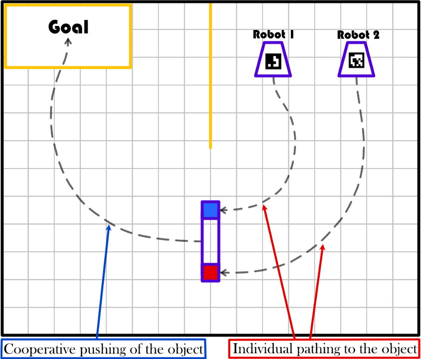
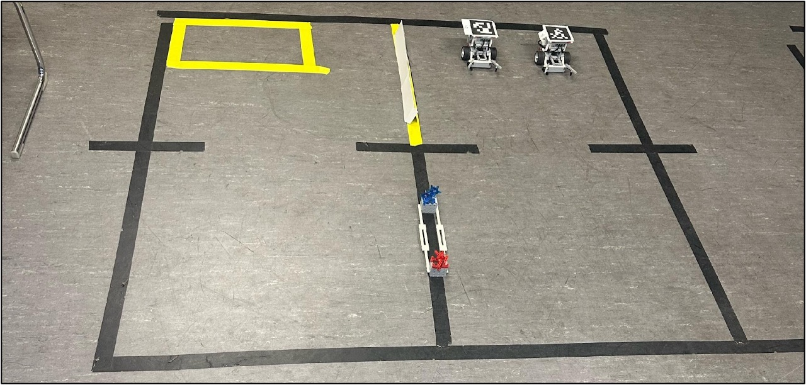
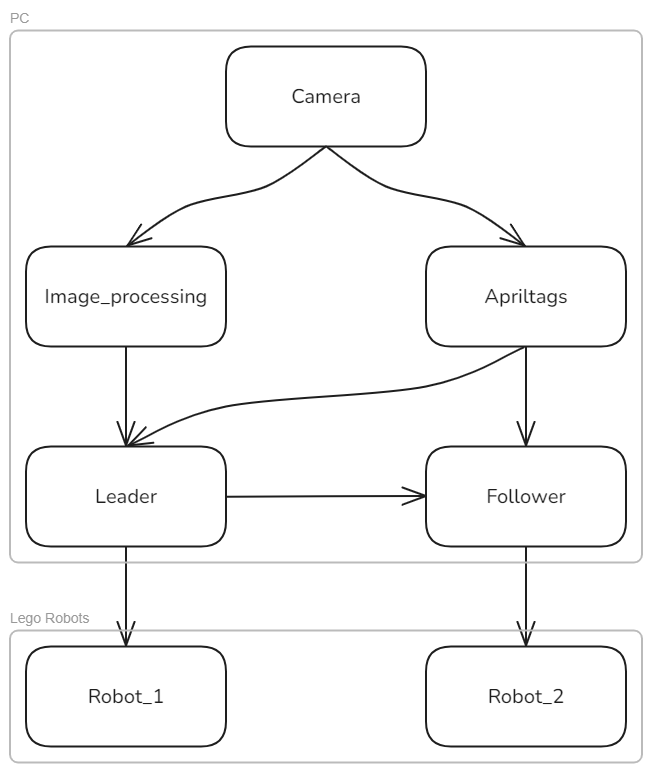
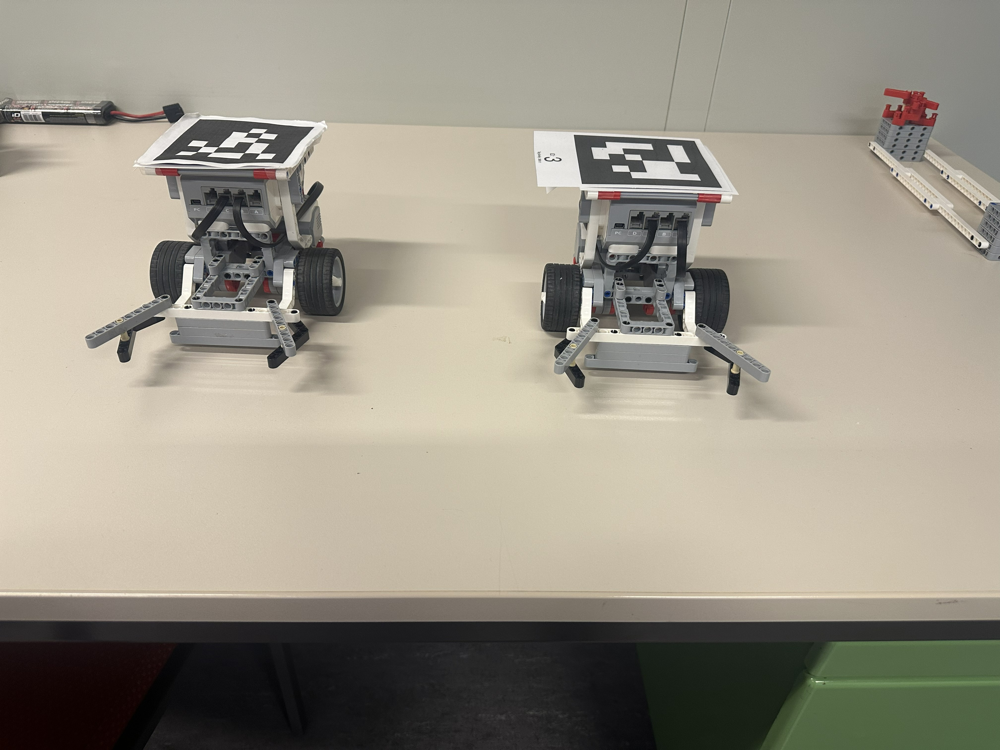

# Coordinated Transport Operation in a Multi-Robot System

Two LEGO EV3 robots locate a large object, drive into position, and cooperatively push it across a workspace to a target zone. Coordinated through a leader-follower control scheme running on ROS.

**Note on Repository Status:** This repository documents a completed university lab project at the Institute of Control Systems, RPTU Kaiserslautern-Landau Supervised by Prof. Dr.-Ing. Steven Liu and M.Sc. Chen Cai

It reflects the experimental code used in the lab. It is shared as a showcase rather than a ready-to-run package.

## Overview

Moving items is a routine automation task, but standard single-robot solutions break down once an object gets too large or heavy for one machine to handle alone. Rather than relying on one large, expensive robot, this project explores a team-based approach: two smaller robots combine their force and coordinate their movement to move an object neither could handle alone.

The finalized task: starting from a dynamic position, the robots locate the object, align themselves against it, and push it as a coordinated pair to a fixed destination zone.

**Sketch:**

**Real world setup**

## Objectives

1. **Approach the contact points:**
    autonomously locate and drive to the two end points on the object
2. **Achieve correct orientation:**
    align against the object so pushing is effective, not just arrival
3. **Cooperative movement:**
    push the object together without losing formation
4. **Reach the target zone:**
    transport the object all the way to the defined goal area
5. **Dynamic adaptability:**
    handle the object starting from varying positions, not just a fixed setup

## Demo

**Leader-follower pushing a single object:**

<video src="media/demos/LeaderSingelObj.mp4" controls width="600"></video>

**Leader pushing two objects:**

<video src="media/demos/LeaderDoubleObj.mp4" controls width="600"></video>

**Leader-follower pushing two objects:**

<video src="media/demos/LeaderFollowerDoubleObj.mp4" controls width="600"></video>

## System Architecture

The system is layered into perception, control, and actuation, connected over ROS:

### Perception:
- **Image Processing**
    color-based detection of the object, estimating its position and orientation in the workspace from the overhead camera feed (OpenCV, via `cv_bridge`)
- **AprilTag Detection**
    (`apriltag_ros`) localizes each robot relative to the object and workspace using tags mounted on the robots

### Control via Leader/Follower:
- **Leader**
    fuses the perception outputs, plans the trajectory toward the object and goal zone, and computes control commands via a nonlinear Model Predictive Controller
- **Follower**
    reacts to the Leader's motion, holding a fixed relative distance and orientation to keep the pair pushing as one rigid unit

### Actuation:
- Two differential-drive LEGO robots (EV3 bricks, static front grippers), commanded over WiFi via `rpyc`

## Hardware

- WiFi router (TP-Link Archer C1200)
- Ceiling-mounted webcam (Microsoft LifeCam Studio), streamed via `video_stream_opencv`
- Central computer running ROS core + the control stack
- Two LEGO EV3 differential-drive robots with static grippers
- Object(s) distinguished by color, built from LEGO bricks

### Software Stack

- **ROS1 (catkin):**
for inter-process communication between perception, control, and robot nodes
- **C++:**
Leader control node, nonlinear MPC (CppAD + Ipopt, Eigen)
- **Python / OpenCV:**
color-based object detection
- **apriltag / apriltag_ros:**
robot pose estimation (vendored as git submodules)
- **video_stream_opencv:**
camera streaming into the ROS graph (vendored as a git submodule)
- **rpyc:**
sends the computed control signals to the LEGO EV3 bricks

### Future Extensions

1. The approach angle is currently hardcoded based on the object's known orientation. Computing a separate coordinate frame for the object (e.g., via its own AprilTag) would allow the Follower to track the object's actual extent rather than an assumed length, and help avoid asynchronous pushing at the start of a run.
2. Obstacle avoidance and a dynamic (rather than fixed) end zone are natural next steps beyond this.
